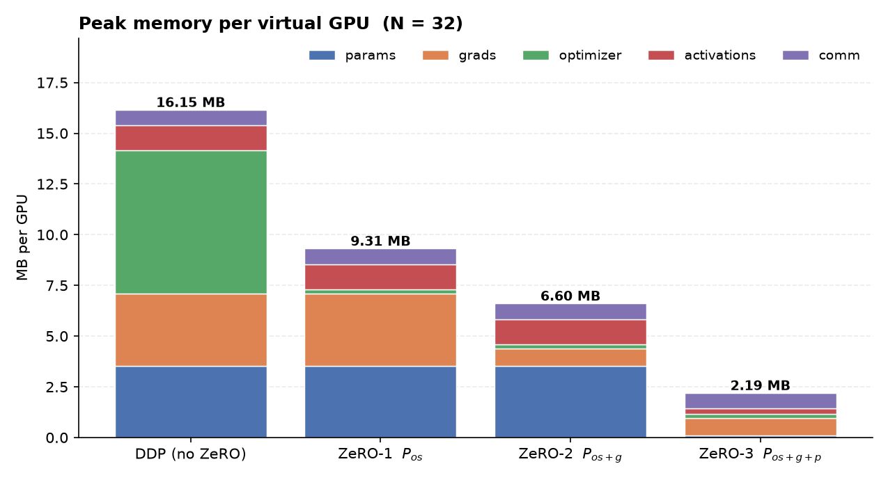
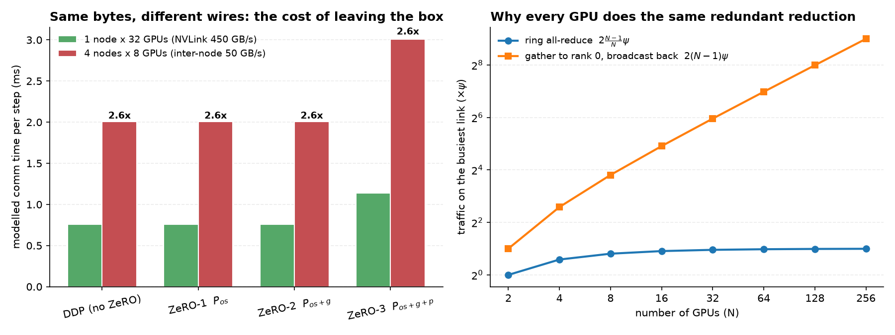
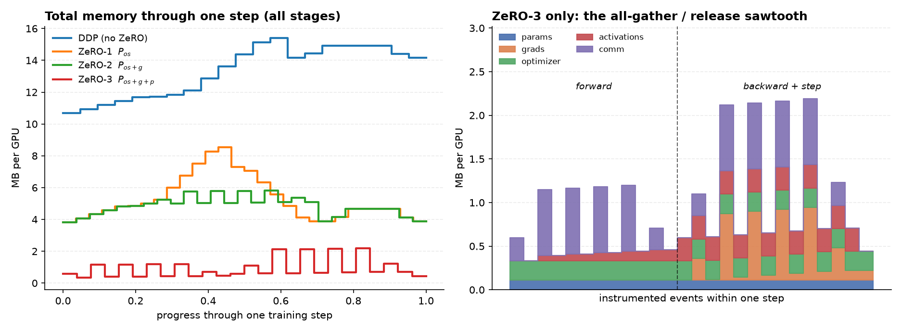
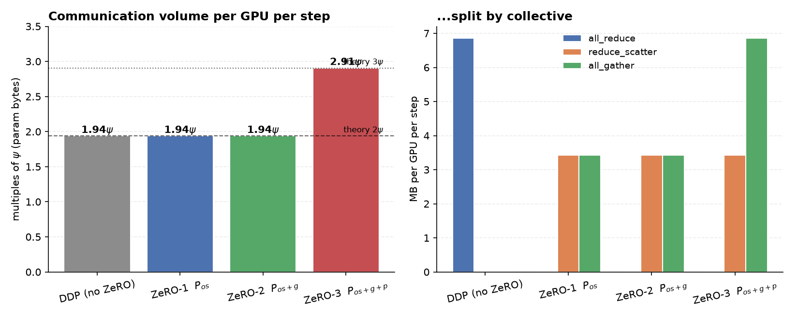
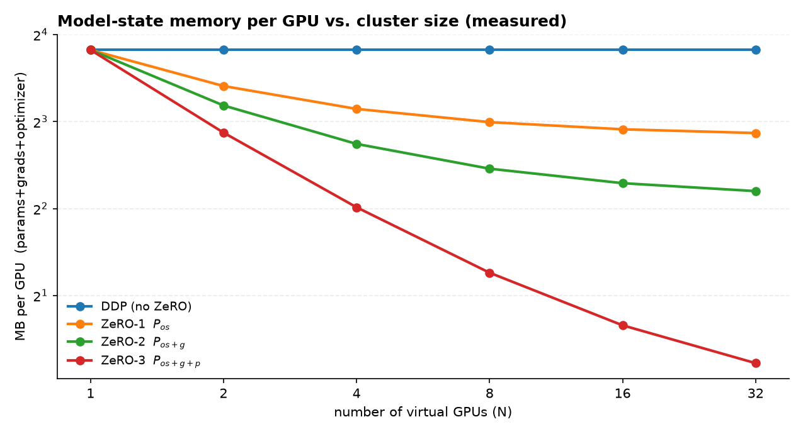
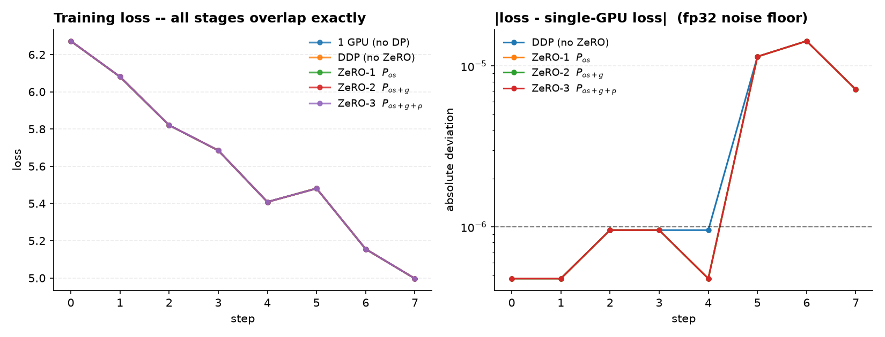
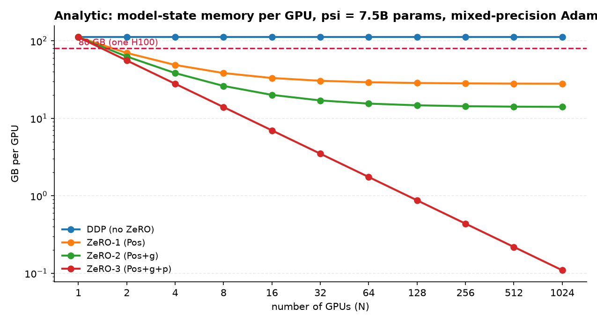

# ZeRO from scratch on 32 virtual GPUs

A working implementation of **ZeRO stages 1, 2 and 3** — sharded optimizer, sharded gradients,
sharded parameters — running on a 32-device "GPU cluster" built out of CPU threads, training a small
GPT end to end.

Nothing is mocked. The collectives move real tensors, the optimizer really does update only the slice
of the weights a rank owns, and under ZeRO-3 the full weight matrix genuinely does not exist in any
rank's memory except during the microsecond its layer is computing. All five configurations
(1 GPU, DDP, ZeRO-1, ZeRO-2, ZeRO-3) train to the **same loss and the same final weights** — which is
the only acceptable proof that a memory optimization is actually a memory optimization.

📓 **[`ZeRO_on_32_Virtual_GPUs.ipynb`](ZeRO_on_32_Virtual_GPUs.ipynb)** — the full walkthrough with
outputs. Everything below is reproduced there by `python run_all.py`.

---

## Headline result

TinyGPT, 928,512 parameters, fp32 + Adam (16 bytes/param), 32 virtual GPUs, global batch 32, 8 steps:

| | **model state / GPU** | params | grads | optimizer | comm / step | loss 0 → 8 |
|---|---|---|---|---|---|---|
| 1 GPU (batch 32) | 14.17 MB | 3.54 | 3.54 | 7.08 | — | 6.2725 → 4.9970 |
| DDP (no ZeRO) | **14.17 MB** | 3.54 | 3.54 | 7.08 | 1.938 ψ | 6.2725 → 4.9970 |
| ZeRO-1 · $P_{os}$ | **7.31 MB** | 3.54 | 3.54 | **0.22** | 1.938 ψ | 6.2725 → 4.9970 |
| ZeRO-2 · $P_{os+g}$ | **4.60 MB** | 3.54 | **0.84** | **0.22** | 1.938 ψ | 6.2725 → 4.9970 |
| ZeRO-3 · $P_{os+g+p}$ | **1.17 MB** | **0.11** | **0.84** | **0.22** | 2.906 ψ | 6.2725 → 4.9970 |

**12.1× less model-state memory than DDP** with an identical loss curve, and **ZeRO-1 and ZeRO-2 cost
exactly what DDP costs to communicate.** Only stage 3 pays anything.

*"Model state" = params + gradients + optimizer, the quantity ZeRO is about and the one the paper
tabulates. Peak totals including activations and gather buffers are reported separately below, and I
control for the activation confound in §5.*



Read that chart left to right and each stage deletes exactly one block: ZeRO-1 the green optimizer
block, ZeRO-2 the orange gradient block, ZeRO-3 the blue parameter block.

---

## 1. Why ZeRO has to exist

The number that drives everything: **mixed-precision Adam costs 16 bytes per parameter.**

| tensor | dtype | bytes/param |
|---|---|---|
| parameter (fp16 copy used for fwd/bwd) | fp16 | 2 |
| gradient | fp16 | 2 |
| fp32 **master** weight | fp32 | 4 |
| Adam momentum `m` | fp32 | 4 |
| Adam variance `v` | fp32 | 4 |
| | | **16** |

The three fp32 tensors are not optional. fp16 has ~10 mantissa bits, so `w += lr * small_update`
rounds straight back to `w` and training silently stalls; you need a full-precision master copy and
full-precision moments. Which means **optimizer state is 12 of the 16 bytes — 75% of the
footprint.** The weights everyone thinks of as "the model" are 2 bytes out of 16.

Put a concrete model through that: **30B parameters x 16 bytes = 480 GB = 447 GiB of
training state.** A single 80 GB card holds ~74 GiB usable, so a 30B model needs **six cards
just to hold it**, before a single FLOP of useful work happens. That is the wall.

For a 7.5B model the same arithmetic gives 120 GB *per GPU*, and here is what makes it a real
problem:
**data parallelism does not reduce it by one byte.** DDP replicates. Buy 1000 GPUs and you own 1000
identical copies of the same 120 GB. The memory ceiling on model size is completely independent of
cluster size.

ZeRO's insight is that this replication is pure redundancy — at any instant, 31 of 32 ranks are doing
nothing useful with their copy of Adam's `v`. So **partition it instead of replicating it**, and
fetch the pieces with a collective at the moment they are needed. You trade communication for memory
and get near-linear memory reduction in N, with no change to the mathematics.

The three stages just answer *how much are we willing to partition?*

| | optimizer | gradients | parameters | memory/GPU |
|---|---|---|---|---|
| DDP | replicated | replicated | replicated | $16\Psi$ |
| **ZeRO-1** $P_{os}$ | **sharded** | replicated | replicated | $4\Psi + 12\Psi/N$ |
| **ZeRO-2** $P_{os+g}$ | **sharded** | **sharded** | replicated | $2\Psi + 14\Psi/N$ |
| **ZeRO-3** $P_{os+g+p}$ | **sharded** | **sharded** | **sharded** | $16\Psi/N$ |

---

## 2. The 32 virtual GPUs

From the training loop's point of view a GPU cluster is only three things: N independent execution
contexts, private memory per context, and collectives that move tensors between them. All three are
available from CPU threads.

[`vgpu/fabric.py`](vgpu/fabric.py) provides:

* **32 `VirtualGPU` objects**, each with its own memory ledger and communication ledger.
* **Four real collectives** — `broadcast`, `all_reduce`, `reduce_scatter`, `all_gather` — built on a
  `threading.Barrier` and a shared staging area. torch ops release the GIL, so the ranks genuinely
  interleave across the host's cores.
* **A ring cost model.** Every collective is charged wire bytes *and* latency hops:

$$\text{all\_gather} = \text{reduce\_scatter} = \tfrac{N-1}{N}S \;\;(N-1 \text{ hops}),\qquad
  \text{all\_reduce} = 2\tfrac{N-1}{N}S \;\;(2(N-1) \text{ hops})$$

That $\frac{N-1}{N}$ is the reason an all-reduce costs $2\Psi$ and not $N\Psi$: a ring all-reduce
*is* a reduce-scatter followed by an all-gather, and each rank only ever ships $N-1$ of the $N$
chunks. Internalising that identity is what makes stages 1 and 2 *obviously* free rather than
surprisingly free.

Charging latency **per hop** rather than per call matters: a ring collective is $N-1$ sequential
steps, so on a slow link with many ranks the latency term dominates the bandwidth term. (Real NCCL
switches to tree algorithms exactly when that happens; I model the ring only, and say so.)

### What is real and what is modelled

| | |
|---|---|
| **Real** | the tensors; the maths; the partitioning; which rank owns which slice; the sequence and count of collectives per step; the bytes each puts on the wire; the memory each rank holds |
| **Modelled** | the **time** a collective takes. Threads share RAM, so a "transfer" is a memcpy and would be unrealistically fast. Comm time is computed from the cost model, never measured |
| **Not simulated** | comm/compute overlap and prefetch, kernel scheduling, NUMA, real NCCL algorithm selection |

Memory is *measured*, not asserted: [`vgpu/memory.py`](vgpu/memory.py) keeps a per-rank ledger with
five buckets (params / grads / optimizer / activations / comm), and **activation memory is measured
directly** via `torch.autograd.graph.saved_tensors_hooks` — every tensor autograd stashes for the
backward pass is intercepted, de-duplicated by storage pointer, and charged at its full storage size
(charging the view's `numel` would undercount by ~14%, since `qkv.split()` produces three views over
one storage).

### Vocabulary

The fabric uses the standard distributed-training vocabulary, so the code reads the way the
concepts are usually named:

| term | in this repo | meaning |
|---|---|---|
| **node** | `Fabric(gpus_per_node=8)` | one physical box, almost always 8 GPUs |
| **world size** | `Fabric(world_size=32)` | total GPUs across all nodes |
| **rank** | `rank` arg to every worker | which GPU this is, 0..world_size-1 |
| **collective** | `all_reduce`, `all_gather`, ... | an operation every rank runs together |
| **interconnect** | `Interconnect` profiles | the wires: NVLink inside a box, fabric between boxes |
| **Psi (or P)** | `comm_ratio_psi` | one full copy of the parameters; all comm volume is quoted as a multiple of it |

So when the tables below say ZeRO-3 costs **3 Psi**, that means every step it pushes three full
copies of the model through each GPU's link.

### The cluster is not flat: what it costs to leave the box

A 32-GPU cluster is not 32 equal peers. It is **4 nodes of 8**, and the two kinds of wire are
an order of magnitude apart:

* **inside a box** the 8 GPUs talk over NVLink/NVSwitch at ~450 GB/s
* **between boxes** you get ~50 GB/s -- **9x slower**

`Fabric(world_size=32, gpus_per_node=8)` models this. A ring collective is a *pipeline*, so it
runs at the rate of its slowest hop: the instant a ring spans two boxes, the whole collective
is paced by the inter-node link. Same bytes, different wire:

| | 1 node x 32 GPUs | 4 nodes x 8 GPUs | penalty |
|---|---|---|---|
| DDP | 0.760 ms | 2.004 ms | 2.6x |
| ZeRO-1 | 0.760 ms | 2.004 ms | 2.6x |
| ZeRO-2 | 0.760 ms | 2.004 ms | 2.6x |
| ZeRO-3 | 1.140 ms | 3.006 ms | 2.6x |



The ratio is uniform, but the *absolute* penalty is not: ZeRO-3's premium over ZeRO-2 grows from
+0.38 ms inside one box to **+1.0 ms across four**. That is the practical rule -- ZeRO-3 is close
to free on NVLink and progressively less attractive the more node boundaries your ring crosses.
(Real NCCL softens this with hierarchical algorithms: reduce-scatter inside each node first, so
only 1/8th of the data crosses the slow link. I model the flat ring, which is the pessimistic
case, and say so.)

### Why doesn't one GPU just do the averaging?

The obvious question about all-reduce: instead of every GPU redundantly computing the same
average, why not gather everything to rank 0, average once, and broadcast back?

Because it does not scale, and the fabric makes the reason measurable. Gathering to one rank
forces **2(N-1)Psi** through that single GPU's link, while a ring spreads it so every link
carries only **2(N-1)/N Psi**:

| N | ring all-reduce | gather to rank 0 + broadcast |
|---|---|---|
| 8 | 1.75 Psi | 14 Psi |
| 32 | 1.94 Psi | 62 Psi |
| 256 | 1.99 Psi | 510 Psi |

The ring flattens out just below 2 Psi no matter how large the cluster gets; the centralised
version grows linearly and saturates one poor GPU's wire. On top of that, while rank 0 reduces,
the other 31 GPUs are idle -- and an idle GPU is the one thing a training run cannot afford.
The "redundant" computation every rank performs is free, because they would otherwise be
waiting anyway.

That right-hand panel above is the whole argument in one chart.

---

## 3. The demo model

[`vgpu/model.py`](vgpu/model.py) — a pre-LayerNorm decoder-only GPT: token + position embeddings,
4 transformer blocks (causal self-attention + GELU MLP), final norm, LM head. 928,512 parameters,
trained on a small *learnable* synthetic task (predict token+1 mod vocab) so the loss actually
descends and "all stages trace the same curve" is a claim about something.

The one unusual thing: **it is not an `nn.Module` with `.parameters()`.** It is a list of `LayerSpec`s

```python
LayerSpec(name, [(param_name, shape), ...], fn(x, P))   # P is a plain dict of tensors
```

This is not a style choice, it is *what makes ZeRO-3 implementable at all*. If weights are
permanently attached to a module you cannot make them not exist. By passing them in per call, ZeRO-3
can materialise a layer's weights one instruction before the layer runs and drop them one instruction
after.

Each `LayerSpec` is also exactly one **ZeRO parameter group** — the granularity at which we shard,
gather and reduce. DeepSpeed and PyTorch FSDP do the same thing under the names *bucket* and
*FlatParameter*. Each group is one flat fp32 vector, zero-padded to a multiple of N so it divides
evenly; views into it recover the individual weight tensors without copying, so autograd flows
straight back to the flat buffer.

---

## 4. The stages, and what I learned implementing each

### DDP — the baseline worth understanding first

DDP does one thing well and one thing not at all:

* ✅ **Activations.** Each rank runs batch 1 instead of batch 32, so activation memory drops from
  35.26 MB to 1.22 MB. A genuine, large win.
* ❌ **Model state.** Parameters, gradients and moments are replicated — all 32 ranks carry the same
  14.17 MB, and that number does not move no matter how many ranks you add.

Which is the whole problem, because at N=32 model state is **92% of DDP's footprint**. One collective
per parameter group per step: all-reduce the gradients, $2\frac{N-1}{N}\Psi$.

### ZeRO-1 ($P_{os}$) — shard the optimizer

**The move.** Rank $r$ keeps Adam's `m` and `v` only for its $1/N$ slice. Nothing else changes shape.

**Why it's safe.** Adam is *element-wise*. The update for weight $i$ depends on $g_i, m_i, v_i$ and
nothing else. Partitioning it across ranks is not an approximation — it is deciding who does which
subset of an embarrassingly parallel computation.

**What it costs.** Each rank now only updates $1/N$ of the weights, so afterwards the ranks disagree
about the other $(N-1)/N$. One all-gather of the updated parameters repairs that.

**And here is the thing I did not properly appreciate until I measured it:** ZeRO-1 replaces DDP's
`all_reduce` with `reduce_scatter` + `all_gather`, which is **the same total volume** —
$\frac{N-1}{N}\Psi + \frac{N-1}{N}\Psi = 2\frac{N-1}{N}\Psi$. A ring all-reduce already *is* those
two operations; ZeRO-1 simply declines to reassemble the gradient in the middle and uses the
partitioning it was handed for free.

Measured: DDP 1.938 ψ/step, ZeRO-1 1.938 ψ/step. **Identical.** Optimizer memory 7.08 MB → 0.22 MB
for zero communication cost, which is why stage 1 should essentially always be on.

### ZeRO-2 ($P_{os+g}$) — shard the gradients

**The move.** If rank $r$ only ever *uses* the gradient for its own slice — which is all stage 1
left it doing — why is it storing the whole gradient buffer?

**The subtlety, and what I think is the real insight of stage 2.** ZeRO-1 already issues a
reduce-scatter. But it issues it *after the entire backward pass has finished*, by which point the
full gradient tensor has already been materialised and the memory already spent. Stage 2 changes
**when**, not **what**:

> reduce-scatter each layer's gradient **the instant that layer's backward completes**, keep your
> $1/N$, and free the full buffer before the next layer's backward even begins.

Same collective, same bytes, different moment. In [`vgpu/zero.py`](vgpu/zero.py) it is literally a
`register_post_accumulate_grad_hook` per parameter group:

```python
def hook(p):                                   # fires the moment this layer's grad is complete
    gsh = self.fabric.reduce_scatter(self.rank, p.grad)   # keep 1/N
    g["gshard"] = gsh if g["gshard"] is None else g["gshard"] + gsh
    p.grad = None                              # release the full buffer immediately
```

Measured gradient peak: 3.54 MB → 0.84 MB, communication unchanged at 1.938 ψ. Stage 2 is also free.

This is also exactly why every real implementation exposes a `reduce_bucket_size` knob: the transient
is one bucket, so bucket size is a direct memory ↔ efficiency dial.

### ZeRO-3 ($P_{os+g+p}$) — shard the parameters

The only stage that changes the forward pass, and the only one that costs anything.

**The move.** Rank $r$ stores $1/N$ of every weight matrix. You cannot multiply by a fraction of a
weight matrix, so immediately before a layer runs the cluster all-gathers that layer's weights; the
layer computes; the gathered copy is freed.

The entire implementation is one autograd Function (`ZeroLayerFn`):

```python
forward:   full = all_gather(shard)       # materialise layer L's weights
           out  = layer(x, full)
           del full                       # ...and they are gone again

backward:  full   = all_gather(shard)     # re-materialise (we threw them away)
           grads  = local_backward(...)   # gradient w.r.t. the FULL weight
           gshard = reduce_scatter(grads) # keep only my 1/N
```

**Three consequences fall straight out of those six lines:**

1. **Peak parameter memory is one layer, not the model.** This is what removes the ceiling: you no
   longer need the model to fit on a GPU, only its largest single layer. Measured resident
   parameters: 0.11 MB = ψ/N exactly.
2. **Communication goes from $2\Psi$ to $3\Psi$** — two all-gathers (forward and backward) plus one
   reduce-scatter. Measured: 2.906 ψ = $3\frac{31}{32}\Psi$. That 1.5× is ZeRO-3's whole price, and
   it is why stages 1–2 are automatic and stage 3 is a decision.
3. **Backward has to recompute the layer**, because the backward of the activations needs weights we
   deleted. That is activation checkpointing arriving as a side effect — see §5, where I control for
   it rather than banking the win.

The `keep_gathered=True` flag holds gathered weights from forward through backward instead: no second
all-gather ($3\Psi \to 2\Psi$), but every layer's weights stay resident, so peak parameter memory
becomes the whole model. That is not "ZeRO-3 with a knob" — it is precisely FSDP's
`reshard_after_forward=False` / `SHARD_GRAD_OP`, and it is measured both ways in the notebook.

---

## 5. Controlling for the activation confound

ZeRO-3 recomputes in backward; the other stages do not. That hands ZeRO-3 layer-wise activation
checkpointing for free — and activations are the largest non-model-state term, so a naive
"peak memory" comparison flatters stage 3. In the paper, $P_{os+g+p}$ changes **model state only**;
partitioned activation checkpointing is a separate mechanism (ZeRO-R / $P_a$).

So `run_all.py` also runs a control in which **every** stage recomputes (`checkpoint=True`), putting
them on identical activation footing:

| | activations | model state | peak total |
|---|---|---|---|
| DDP | 208 KB | 14.17 MB | 14.92 MB |
| ZeRO-1 | 208 KB | 7.31 MB | 7.51 MB |
| ZeRO-2 | 208 KB | 4.60 MB | 4.80 MB |
| ZeRO-3 | 208 KB | 1.17 MB | 2.13 MB |

Activations identical across all four, losses still identical. **7.0× peak reduction DDP → ZeRO-3
that is not an artifact of checkpointing**, and 12.1× on model state itself. This is the number I
stand behind.

---

## 6. What the measurements show

### Memory through a single step



This is the clearest picture of the three stages I can produce:

* **DDP** climbs as each layer's gradient appears and then just *stays there* — nothing is released.
* **ZeRO-1** climbs identically, then falls off a cliff: the reduce-scatter at the end of backward.
  Same peak as DDP, same comms — but it ends the step holding a shard.
* **ZeRO-2** never climbs. The sawtooth is each layer's gradient being scattered and freed as soon as
  it is ready. *This picture is the difference between stage 1 and stage 2.*
* **ZeRO-3** is flat and low throughout, with the gather/release teeth visible.

The right panel is the ZeRO-3 sawtooth on its own scale: each tooth in the forward half is one layer
being materialised and destroyed; the taller teeth in the backward half are the re-gather plus that
layer's full gradient, just before the reduce-scatter removes it.

### Communication



Per rank per step, 6 parameter groups:

| | calls | all_reduce | reduce_scatter | all_gather | total |
|---|---|---|---|---|---|
| DDP | 6 | 6.86 MB | — | — | 1.938 ψ |
| ZeRO-1 | 12 | — | 3.43 MB | 3.43 MB | 1.938 ψ |
| ZeRO-2 | 12 | — | 3.43 MB | 3.43 MB | 1.938 ψ |
| ZeRO-3 | 18 | — | 3.43 MB | **6.86 MB** | 2.906 ψ |

ZeRO-3's all-gather column is exactly double the others' — forward and backward. This is the theory
reproduced from measurement rather than asserted.

### Scaling 1 → 32 GPUs



Measured model-state memory per GPU (MB):

| N | DDP | ZeRO-1 | ZeRO-2 | ZeRO-3 |
|---|---|---|---|---|
| 1 | 14.17 | 14.17 | 14.17 | 14.17 |
| 2 | 14.17 | 10.63 | 9.10 | 7.33 |
| 4 | 14.17 | 8.85 | 6.70 | 4.04 |
| 8 | 14.17 | 7.97 | 5.50 | 2.40 |
| 16 | 14.17 | 7.53 | 4.90 | 1.58 |
| 32 | **14.17** | **7.31** | **4.60** | **1.17** |

DDP is a flat line — the entire point. The ZeRO curves fall towards their asymptotes $4\Psi$, $2\Psi$
and $0$.

### Where the idealised formula stops holding — and why that's the interesting part

ZeRO-3 at N=32 predicts $16\Psi/N$ = 0.44 MB. I measured **1.17 MB**. That gap is not a bug, and
chasing it down taught me more than reproducing the formula would have:

The closed form accounts only for *steady-state* residency. It ignores the **transient**: at the
moment the largest block's gradient is complete but not yet reduce-scattered, that full 0.79 MB
buffer is live. Once $\Psi/N$ drops below the size of a single layer, the transient dominates and the
curve stops shrinking. Same reason ZeRO-2's gradient peak is 0.84 MB rather than the ideal 0.11 MB.

This is real — DeepSpeed has it too, and it is precisely what `reduce_bucket_size` and
`stage3_prefetch_bucket_size` exist to control. **The practical floor on ZeRO memory is set by your
largest layer, not by N.**

### Correctness



| comparison | max &#124;ΔW&#124; over all 928,512 weights |
|---|---|
| ZeRO-1 vs ZeRO-2 | **0.000e+00** |
| ZeRO-1 vs ZeRO-3 | **0.000e+00** |
| ZeRO-2 vs ZeRO-3 | **0.000e+00** |
| DDP vs any ZeRO stage | 8.35e-06 |
| any distributed stage vs 1 GPU | 9.13e-05 |

This is a sharper result than I expected and it is worth reading carefully. **The three ZeRO stages
are bit-identical to each other** — not approximately, exactly — because all three reduce gradients
with the same `reduce_scatter` and therefore sum the ranks' contributions in the same order. DDP
differs in the last few ulps only because a ring `all_reduce` associates the sum differently, and the
single-GPU run differs because it sums 32 microbatches as one batch instead of 32 partial sums.

In other words the *only* differences anywhere are floating-point summation order. **ZeRO is doing
the same maths in less memory** — which is the claim, and now it is a measurement rather than an
assertion.

---

## 7. Extrapolating to models that matter

The closed-form model in `analytic_memory()` reproduces **Table 1 of the ZeRO paper**
(Ψ = 7.5B, N = 64, mixed-precision Adam):

| | mine | paper |
|---|---|---|
| DDP | 120.0 GB | 120 GB |
| ZeRO-1 | 31.41 GB | 31.4 GB |
| ZeRO-2 | 16.64 GB | 16.6 GB |
| ZeRO-3 | 1.88 GB | 1.9 GB |



Largest model whose *state* fits in 70 GB/GPU (billions of parameters):

| N | DDP | ZeRO-1 | ZeRO-2 | ZeRO-3 |
|---|---|---|---|---|
| 1 | 4.4 | 4.4 | 4.4 | 4.4 |
| 8 | 4.4 | 12.7 | 19.1 | 35.0 |
| 32 | 4.4 | 16.2 | 28.6 | 140.0 |
| 64 | 4.4 | 16.8 | 31.1 | 280.0 |
| 1024 | 4.4 | 17.4 | 33.9 | 4480.0 |

**DDP: 4.4B no matter how many GPUs you buy.** That column is the entire reason ZeRO exists.

---

## 8. The cost side

Modelled communication time per step at N=32, using our measured byte counts and call counts with
per-hop ring latency:

| interconnect | DDP | ZeRO-2 | ZeRO-3 | ZeRO-3 / DDP |
|---|---|---|---|---|
| NVLink-4 / NVSwitch (300 GB/s) | 0.768 ms | 0.768 ms | 1.152 ms | 1.50× |
| InfiniBand NDR (50 GB/s) | 2.004 ms | 2.004 ms | 3.006 ms | 1.50× |
| PCIe 4.0 x16 (25 GB/s) | 3.264 ms | 3.264 ms | 4.896 ms | 1.50× |
| 100 GbE (12.5 GB/s) | 15.456 ms | 15.456 ms | 23.184 ms | 1.50× |

The 1.50× is exact in both terms, and that is not a coincidence: ZeRO-3 sends 1.5× the bytes *and*
pays 1.5× the latency hops (18 calls × (N−1) vs 6 calls × 2(N−1)). **ZeRO-2 is free in time as well
as in volume.** ZeRO-3's 1.5× is cheap on NVLink inside a node and expensive over Ethernet, which is
exactly why DeepSpeed defaults to stage 2 and you reach for stage 3 when the model genuinely does not
fit. (Real ZeRO-3 also prefetches layer L+1's all-gather behind layer L's compute, hiding much of
this; I do not model overlap, so these are pessimistic for stage 3.)

And the numbers above are for a **flat** cluster. Section 2 shows what happens once the ring
crosses node boundaries: ZeRO-3's premium over ZeRO-2 grows from **+0.38 ms inside one box to
+1.0 ms across four**. "Which ZeRO stage should I use" is not answerable without knowing your
topology.

---

## 9. Repo layout & running it

```
vgpu/
  fabric.py      32 virtual GPUs, 4 collectives, ring cost model, node topology
                 (gpus_per_node) and intra-/inter-node interconnect profiles
  memory.py      per-rank memory ledger + activation measurement via saved_tensors_hooks
  model.py       TinyGPT as a list of (params, fn) LayerSpecs — the functional form ZeRO-3 needs
  zero.py        ZeroLayerFn (stage 3), CheckpointLayerFn (fairness control), ZeroEngine
  experiment.py  run one stage across the cluster; analytic memory/comm formulas
  report.py      tables and figures
run_all.py       reproduce every number and figure in this README
ZeRO_on_32_Virtual_GPUs.ipynb   the full walkthrough
```

```bash
pip install torch numpy pandas matplotlib
python run_all.py               # ~4 min on 8 cores: all stages + fairness control + sweep + figures
python run_all.py --quick       # ~1 min
```

Runs on CPU anywhere (the "GPUs" are threads). On Colab, open the notebook and run all — the first
cell clones this repo if needed. **No actual GPU required**, which is rather the point: you can study
32-way sharding on a laptop.

Tested on torch 2.11 / Python 3.12 / 8 physical cores (32 threads = 4× oversubscription, fine given
that the point is memory and message accounting, not throughput).

---

## 10. Honest limitations

* **Comm time is modelled, not measured** (threads share RAM). Volumes, call counts and hop counts
  are real; the ring model ignores NCCL's tree algorithms for latency-bound messages.
* **The multi-node model uses a flat ring**, paced by its slowest hop. Real NCCL is hierarchical
  (reduce-scatter inside each node first, so only 1/8th of the data crosses the slow link), so my
  inter-node penalty is an upper bound. The direction and the reason are right; the magnitude is
  pessimistic.
* **No compute/communication overlap or prefetch**, so all time numbers are a pessimistic bound for
  stage 3 in particular.
* **fp32 throughout, not mixed precision.** fp32+Adam also happens to be 16 bytes/param (4+4+4+4), so
  the ratios match the paper's mixed-precision accounting exactly; only the split within the 16
  differs. `analytic_memory()` covers both, and the sweep comparison uses `precision="fp32"` to match
  what actually ran.
* **The 1-GPU baseline is a numerical reference, not a memory comparator** — it runs the full global
  batch, so its 35 MB of activations is a batch-size effect, not a ZeRO effect.
* **Step wall time includes barrier waits** and is 32 Python threads on 8 cores; it is reported as
  `step_wall_s`, not as "compute time", and no conclusion rests on it.
* **The task is synthetic** (predict token+1). The loss descends, which makes the agreement test
  meaningful, but this is not a language-modelling result.
* Bandwidth uses SI GB/s (vendor convention) while memory uses binary MB/GB — ~7% apart where they
  appear together.
* **No ZeRO-Offload / ZeRO-Infinity** (CPU and NVMe offload), no tensor or pipeline parallelism, no
  weight tying, clipping or dropout.
* 0.93M parameters is small — chosen so 32 replicated copies fit in host RAM. The *ratios* are the
  result, not the absolute MB.

---

## 11. What I take away from building this

1. **75% of training memory is the optimizer, not the model.** Every "the model is too big"
   intuition should really be "the *training state* is too big", and mostly that means Adam.

2. **ZeRO-1 and ZeRO-2 are free — not cheap, free.** Their communication volume *and* latency are
   identical to DDP's, because a ring all-reduce already is a reduce-scatter plus an all-gather;
   ZeRO just declines to throw the partitioning away in between. I did not fully believe this until I
   measured both at 1.938 ψ and both at 0.768 ms.

3. **Stage 2 is a statement about *timing*, not about *what* you send.** Same collective, same bytes,
   issued per-layer during backward instead of once at the end. That timing change is worth 4
   bytes/param, and it is why bucket size is a tunable in every real implementation.

4. **Only stage 3 changes the forward pass, and only stage 3 costs anything** (exactly 1.5×, in bytes
   and in hops). Its payoff is qualitative rather than quantitative: peak parameter memory becomes
   "the largest layer" instead of "the model", which is what removes the ceiling entirely.

5. **None of it changes the maths — and the three ZeRO stages are bit-identical to each other.**
   That was the most satisfying measurement in the project: the only differences anywhere in the
   experiment are floating-point summation order.

6. **The idealised formulas lie a little, and the gap is where the understanding is.** ZeRO-3's
   measured floor was 1.17 MB against a predicted 0.44 MB, entirely because of the one-bucket
   transient. Finding out where a formula stops holding taught me more than reproducing it did.

7. **The cluster is not flat, and that changes the answer.** 32 GPUs is 4 boxes of 8, with ~450
   GB/s inside a box and ~50 GB/s between them. A ring runs at the speed of its slowest hop, so
   crossing a node boundary costs 2.6x on every stage — and because ZeRO-3 moves 1.5x the bytes,
   its *absolute* premium grows with every boundary crossed. I had been thinking about ZeRO as a
   pure memory-vs-bandwidth trade; it is really memory-vs-bandwidth-vs-topology.

8. **The "wasteful" redundant reduction is not wasteful.** Every GPU computing the same average
   looked like obvious duplication until I worked out the alternative: gathering to one rank puts
   2(N-1)Psi through a single wire (62 Psi at N=32, vs 1.94 Psi per link for the ring) and leaves
   31 GPUs idle waiting on a result they cannot proceed without. The redundancy is free because
   the GPUs had nothing else to do.

9. **Measure the confound before you quote the headline.** ZeRO-3 gets activation checkpointing for
   free as a side effect of deleting its weights. Before controlling for that I would have quoted a
   number that was partly measuring something else.

---

## References

* Rajbhandari, Rasley, Ruwase, He — *ZeRO: Memory Optimizations Toward Training Trillion Parameter
  Models*, [arXiv:1910.02054](https://arxiv.org/abs/1910.02054)
* [DeepSpeed ZeRO documentation](https://www.deepspeed.ai/tutorials/zero/)
* [PyTorch FSDP](https://pytorch.org/docs/stable/fsdp.html) — the same partitioning, different API
